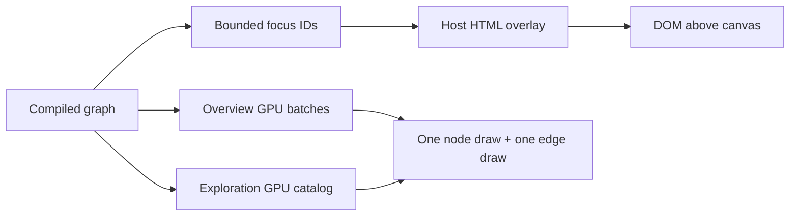

# ADR: Fidelity on demand

**Date:** 2026-08-19
**Status:** Implemented
**Issues:** [#81](https://github.com/domudev/graphraum/issues/81), [#82](https://github.com/domudev/graphraum/issues/82), [#83](https://github.com/domudev/graphraum/issues/83)

## Context

graphraum’s product question is not “React Flow or 100k nodes.” Hosts need both: a dense WebGL graph that stays two draw calls, and a small focused subset that can look like product UI.

The GPU vocabulary already exists: SDF node shapes, strokes, independent axes, and edge width / dash / markers / path kinds packed into one edge batch ([#80](https://github.com/domudev/graphraum/issues/80)). Overlay labels and a single toolbar already project host HTML ([#59](https://github.com/domudev/graphraum/issues/59), [#93](https://github.com/domudev/graphraum/issues/93), [#94](https://github.com/domudev/graphraum/issues/94)). What is missing is an explicit three-tier contract so later work does not put per-node HTML, arbitrary materials, or unbounded labels on the dense path.

[#83](https://github.com/domudev/graphraum/issues/83) (No Man’s Sky starmap) is the visual reference for that contract:

- Overview stays navigable by dropping detail (brightness, size, aggregation), not by drawing every object as UI.
- Mid zoom adds glyphs and routes as batched marks, not documents.
- Close focus is where names, panels, and actions appear.
- Anti-pattern for this engine: per-object HTML at galaxy scale.

Formulas that describe edge curves compile to control points or polyline samples at pack/update time. They do not become per-edge shader programs on the dense path.

## Decision

Same engine, three visual tiers. Hosts move nodes between tiers; the renderer does not invent product chrome.

| Tier | Nodes | Edges | Scale |
| --- | --- | --- | --- |
| Overview | Few SDF shapes, overview LOD (straight, solid, no markers) | Batched | Toward 100k / 300k |
| Exploration | Full GPU shape and path catalog | GPU curves / dashes / markers | Batched, zoom-dependent |
| Focus | Host HTML/React projected by the overlay | Optional tiny HTML/SVG set later | Tens, hard-capped |

Rules:

1. Dense rendering stays GPU batches. New visual language for the mass of the graph is SDF, instance attributes, or packed edge segments — not meshes, React, or CSS per node.
2. Overlay HTML is opt-in, host-supplied, and framework-neutral. graphraum projects world to screen and enforces `maxLabels` / `maxRichNodes`. The host owns accessibility, actions, and component trees.
3. Focus chrome is selected, hovered, or an explicit ID list. Neighbor labels may use the existing `focus` label policy; rich node cards do not automatically include the 1-hop neighborhood.
4. Exceeding a manual rich-node budget fails with an error that names the cap and the requested count. Auto policies slice to the cap so pointer selection cannot crash the host.
5. Rich focused edges are a later overlay API. They are not the dense edge path.

## Verification

**Status is Implemented.** Rich HTML edges and a 100k overlay measurement remain for Verified.

**Implemented evidence (this change):**

- Implementation: `src/overlay.ts` — `GraphraumOverlay.setRichNodes`, `autoRichNodes`; `src/overlay-budget.ts` — `boundOverlayIds`, `selectRichNodeIds`
- Automated: `src/overlay-budget.test.ts`; `bunx vitest run src/overlay-budget.test.ts`
- Demo: `docs/src/components/UseCaseGallery.astro` selected-node HTML card over GPU nodes
- Audit anchor: pending merge commit on `main`

## Alternatives considered

### HTML for every node

Rejected. It abandons the two-draw-call baseline and the 100k target. React Flow already occupies that product shape.

### Shader materials per edge or node

Rejected for the dense path. Curve formulas become samples at update time so instance buffers stay uniform. Custom materials remain a host/post-process concern, not a graphraum catalog.

### Wait for a native WebGPU backend before focus HTML

Rejected. Focus HTML is orthogonal to the backend ([#12](https://github.com/domudev/graphraum/issues/12)). Three/WebGL2 remains production until another backend beats it on the graph workload.

## Consequences

- Graph Lab and other hosts can attach React (or any DOM) to a handful of nodes without forking the renderer.
- Authors cannot treat graphraum as a general scene graph or CSS layout engine.
- Label budget and rich-node budget are separate. A graph can show 24 titles and 1 inspector card.
- Follow-ups: Graph Lab consumption ([#95](https://github.com/domudev/graphraum/issues/95)), optional rich edges, incremental GPU updates ([#16](https://github.com/domudev/graphraum/issues/16)).

## References

- Closed GPU catalog: [#80](https://github.com/domudev/graphraum/issues/80), parent compilation [#30](https://github.com/domudev/graphraum/issues/30)
- Overlay labels/toolbar: [#59](https://github.com/domudev/graphraum/issues/59), [#93](https://github.com/domudev/graphraum/issues/93), [#94](https://github.com/domudev/graphraum/issues/94)
- Performance parent: [#9](https://github.com/domudev/graphraum/issues/9)
- Visual language: [docs/src/content/docs/visual-language.mdx](../src/content/docs/visual-language.mdx)
- Hello Games, No Man’s Sky galactic map — overview vs local presence, not a copy of in-game UI
