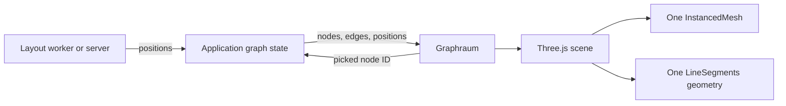

## Rendering contract

Graphraum consumes positioned nodes and edges. It does not run a force layout, fetch data, or infer graph semantics.

This keeps layout work independently replaceable and prevents a complete force simulation from blocking the first useful render.

## On-demand rendering

Graphraum renders when data, selection, camera controls, mode, or container size changes. It does not keep an idle animation loop alive. Calls within one browser frame are coalesced through `requestAnimationFrame`.

## 2D first

The default orthographic camera makes the graph behave as a native 2D surface. The perspective camera is available on demand for structures where depth carries meaning. Both modes use the same node and edge contract.

## Application-owned concerns

The host remains responsible for:

- layout and progressive position updates;
- labels and semantic level of detail;
- keyboard navigation and an accessible node list;
- domain actions such as expand, focus, archive, or inspect;
- persistence and synchronization.

Graphraum provides the rendering primitive, not a replacement application architecture.

## Graphology direction

Graphology is the planned canonical mutable graph input ([PRO-248](https://linear.app/yggdra/issue/PRO-248/add-a-graphology-backed-graphraum-graph-adapter)). Its core graph object supplies node/edge identity, typed attributes, events, traversal, and serialization. Graphraum will subscribe to that contract and render visual attributes; it will not require Graphology's optional layout or algorithm packages.

The existing array snapshot remains useful for static data, transport boundaries, fixtures, and one-shot rendering.
